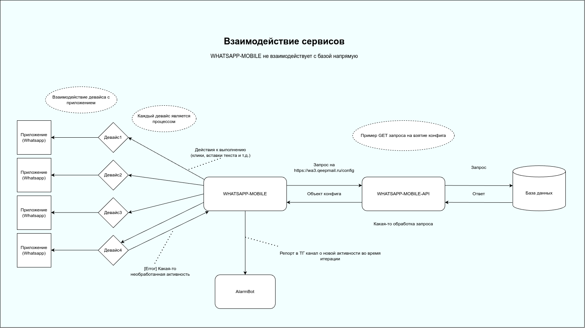

# whatsapp-mobile-env

## Описание
Делает рассылку по имеющейся базе номеров в приложении ватсапа с целью рекламирования определенных услуг.

---

## Взаимодействующие сервисы
___Whatsapp-mobile___ является ключевым проектом, который общается с базой данных через его API сервис.

___Whatsapp-mobile-api___ - сервис, который является воркером (по типу **celery**), 
предоставляющий роуты по взаимодействию с БД. 

Также существует еще один сервис, который 
предназначен для уведомления нас через канал ТГ. Представляет собой API сервис, который принимает запросы от 
Whatsapp-mobile и присылает сообщение с конкретной активностью, из-за которой скрипт стопится и не идет дальше.

Тем самым __Whatsapp-mobile__ взаимодействует с 2 сервисами:
+ _Whatsapp-mobile-api_
+ _AlarmBot_

### Как работают сервисы между друг-другом 
#### Whatsapp-mobile-api
Пример запроса от __Whatsapp-mobile__:

```python
@utils.try_times(attempt_amount=3, attempt_timeout=10, catch_exceptions=CATCH_EXCEPTIONS)
def get_config() -> Config | None:
    route = ROUTES.GET_CONFIG
    response = route.method(route.url, headers={'Authorization': AUTH}, timeout=route.timeout)
    uuid = response.json()['uuid']
    if item := wait_for_task(uuid):
        return Config(**item)
```


Разберем построчно:

```python
@utils.try_times(attempt_amount=3, attempt_timeout=10, catch_exceptions=CATCH_EXCEPTIONS)
```
Декоратор, который при ошибке в запросе повторит его `attempt_amount` раз с `attempt_timeout` задержкой(секунды).
В `CATCH_EXCEPTIONS` перечисляем все Exceptions, которые мы хотим обрабатывать в декораторе.

```python
route = ROUTES.GET_CONFIG
```
Здесь мы берем нужный нам роут

```python
response = route.method(route.url, headers={'Authorization': AUTH}, timeout=route.timeout)
```
Делаем сам запрос, route.method просто requests с каким-то методом запроса. Не забываем про безопасность, 
указываем токен в headers. Тажке указываем `timeout`, чтобы не ждать бесконечно ответа от API сервиса, 
если он вдруг завис


```python
uuid = response.json()['uuid']
```
Сразу после запроса мы получаем уникальный _uuid_ ключ, с помощью которого мы сможем обратиться к этому же сервису
за выполненной таской.


```python
if item := wait_for_task(uuid):
    return Config(**item)
```
Здесь то мы и используем полученный ключ, чтобы взять ответ от сервиса когда ответ будет готов.


### AlarmBot
С __AlarmBot__ мы общаемся только в одностороннем порядке, т.е. отсылаем ошибки, когда они появляются.

```python
files = {
    'project_name': (None, 'WHATSAPP'),
    'message': (None, f'[{config.DATABASE_MODE.upper()}]📱Device: {self.serial}; ❓Unknown activity: {self.current_activity}'),
    'file': (file.name, file, 'image/jpeg'),
}

try:
    response = requests.post('http://65.108.49.8:6100/error', files=files,
                             headers={"accept": "application/json", 'Token': '...'},
                             timeout=60)
except Exception as e:
    if isinstance(e, requests.exceptions.ReadTimeout):
        self.logger.error('Ошибка таймаута при отсылке смс в бота(АЛАРМ)')
    else:
        self.logger.error(f'Ошибка неизвестная при отсылке смс в бота(АЛАРМ): {e}')
else:
    self.logger.info(f'Sent error to telegram channel with {response.status_code}')
```

__AlarmBot__ работает для нескольких сервисов одновременно, поэтому указываем в дикте __files__ `'project_name'`.
Далее указываем сообщение и картинку, которую сохраняем на хост машине. 

Обрабатываем и логируем возможные ошибки. 

Схема взаимодействия



---

## Подсказки, которые облегчат жизнь
### Добавление совего номера в контакты
В методе _start_ в файле `core/script_iterator.py` после цикла 

```python
# Случайные контакты для исключения пересечений
for i in range(max(80 - len(contacts_list), self.campaign.contacts_send)):
    contacts_list.append({'phone': str(random.randint(79000000000, 79999999999))})
```

добавить в список свой телефон
```python
contacts_list.append({'phone': 79999999999})
```

Телефон добавится в контакты, которые зальются на телефон, тем самым номер будет участвовать в рассылке


### Скип рефреша контактов

Бывает когда телефон встает на синхронизации номеров (обычно это решается переустановкой ватсапа), 
а нам надо что-то срочно протестировать.

В функции `handle_contacts` в файле `scrip_iteration_rules/activity_methods.py` изменим блок _else_

до:
```python
else:
    if obj.app == 'com.whatsapp':
        obj.contacts_refresh_attempts += 1
    obj.d.press('back')
```

после:
```python
else:
    obj.contacts_refreshed = True
    if obj.app == 'com.whatsapp':
        obj.contacts_refresh_attempts += 1
    obj.d.press('back')
```

### Наполнение кампании базой номеров
Перед запуском кампании, если мы хотим рассылаться, а не только регать, то необходимо заполнить 
эту кампанию номерами, чтобы было откуда брать контакты.

Сделаем такой запрос:
```sql
insert into phones(phone, campaign_id) select phone, 99 from tmp.phones order by random() limit 1000;
```
99 - __айди кампании__, вставляете свою. Лимит также можно изменять.

### Возрождение старых аккаунтов
Во время работы скрипта он регает аккаунта, о которых мы можем забыть. Поэтому в таблице accounts
есть поля `in_work` и `banned`.

Если у аккаунта banned true, то мы уже никак ему не поможем, `banned` 
проставляется в скрипте - означает, что ватсап забанил аккаунт. 

Если у аккаунта `in_work` _true_, то это означает, что скрипт сейчас работает с этим телефоном, поэтому если мы 
запускаем скрипт, то `in_work` у аккаунтов, которые не забанены можно менять на _false_, чтобы их подтягивать 
вместо регистрации новых.

Также если мы хотим потестить рассылку у определенной кампании, то аккаунту можно спокойно поменять `campaign_id`


### Удаление итераций
Если мы хотим оттестить прогревы (определенный список действий перед рассылкой, пока это звонки и смс ботам), но 
аккаунт уже прогревался тогда стоит найти связанные с этим аккаунтом итерации в таблице __iterations__ и удалить 
итерации где `type` = _send_. В этом случае если аккаунт прогревался, и вы еще раз запустили скрипт, он 
также будет прогреваться.

### Как включать/выключать прокси

Прокси привязываются к отдельным фермам, делается это в `public.config`, ключ - _proxy_status_

Пример:

`{  "default": {    "reg": false,    "send": true  },  "a3:cc:25:6a:4d:0d": {    "reg": false,    "send": false  }}`

В данном случае по умолчанию фермы, для которых нет отдельной настройки, будут регать без прокси и слать с прокси т.к.`"default": {    "reg": false,    "send": true  }`

а ферма `a3:cc:25:6a:4d:0d` будет слать без прокси и регать без прокси

---

## Описание логов, которые выводятся
### BANNED при ответе от sms_activate 
__Sms Activate__ - один из сервисов по предоставлению виртуальных номеров, который мы используем.


Ответы:
+ BANNED
+ NO_NUMBERS
+ {"activationId":"2136896871","phoneNumber":"79291448267","activationCost":"45.63","countryCode":"0","canGetAnotherSms":true,"activationTime":"2024-02-16 18:20:47","activationOperator":"megafon"} - это хороший ответ

#### BANNED
При регистрации аккаунта через _sms activate_ сервис может забанить профиль на нем, в связи с этим в логах мы видим 
BANNED. Автоматическим разбаном этих номеров занимается другой скрипт, поэтому нужно только подождать, если после 
10-15 минут ничего не изменилось, то написать Жене/Сослану.

#### NO_NUMBERS
У сервиса пока нету номеров остается только ждать пока появятся.

---

## Виды основных рассылок на текущий момент
Мы нацелены на максимальную рассылку. КПД расчитывается по тому сколько 1 аккаунт рассылает смс до его бана, т.е.
кол-во __смс/бан__.

Сейчас существуют 2 главных способа рассылки:
### Обычная рассылка диалогом
Переходим в диалог каждому контакту и отсылаем ему смс

### Рассылка по группам/коммьюнити
Этот вариант немного посложнее. У ватсапа есть возможность создания коммьюнити, в которых уже можно создавать 
группы. Суть в том, что мы приглашаем в __группу/коммьюнити__ какое-то кол-во контактов и делаем 1 отправление смс, 
тем самым 1 смс покрывает кол-во собеседников. 

Этот метод был нащупан случайно при ручном тесте рассылок и он неплохо себя показал.

---

## Версия ватсапа
Какое-то время ватсап обновляется и нам нужно тестить новые версии и переходить на них, т.к. существует вероятность,
что какие-либо нерабочие схемы вновь оживут.

---

## Описание параметров кампании

Все поля кампании:

Название | Описание
--- | ---
name |	- имя компании, если клиент, то ставить имя клиента в [] скобки 
script_ids |	- скрипты которые будут браться в работу, если у телефона из phones нет поля message
priority |	работает только для WEB
worktime_from |	время в которое рк начнет рассылку, ВНИМАНИЕ регать она будет в любое время!
worktime_to |	время в которое рк закончит рассылку, ВНИМАНИЕ регать она будет в любое время!
is_active |	если true, то начнет рассылку с имеющихся аккаунтов
reg_accounts |	если true, то начнет регистрацию
scan_accounts |	если true, то начнет сканить аккаунты для WEB
messages_limit |	лимит боевых сообщений которые возьмутся из phones для рассылки
read_messages |	если true, то будет сохранять все ответы пользователей в messages_income
accounts_limit |	лимит аккаунтов для 1-ого устройства, т.е. если девайсов 10, то будет максимум 10 аккаунтов
farm |	мак-адрес фермы к которой привяжется компания, сейчас если она пустая и прокси выключена, то все фермы будут брать эту РК, если установить ферму, то рассылка пойдет только с одной РК, если на всех фермах включена прокси, то надо поставить значение “no_proxy”, чтобы можно было слать с аккаунтов без прокси, по умолчанию все фермы с включенной прокси, если не смогут найти задачи для регистрации и рассылки, используя прокси - будут брать задачи от РК с фермой “no_proxy”
messages_breaktime_min |	минимальная пауза между сообщениями, чтобы слать без пауз - значение 0
messages_breaktime_rand |	прибавка к минимальной паузу между сообщениями, т.е. если минимальная равна 10, то при значение случайной равной 5 - пауза между сообщениями будет от 10 до 15, чтобы слать без пауз - значение 0
algorithm |	параметры для WEB
add_accounts |	хз что это, Андрей схемы мутил, возможно автоматическая ротация аккаунтов, если они закончились
links_pref |	постфикс для ссылки, к пример, если будет значение “golova”, то ссылка будет такой “get2bonus.ru/golova/wtewsd”
domain |	домен с которым будут слаться ссылки, к примеру get2bonus.ru
without_internet |	если true, то рассылка сообщений будет без интернета, т.е. они отправятся в режиме полета, а потом включится интернет
reg_aggregators |	список агрегаторов для регистрации аккаунтов, пример [{"name": "sms_activate", "country": "russia", "operators": ["any"]}], весь список с ценами можно посмотреть в tmp.reg_aggregators_w_prices, для актуализации цен надо зайти на ветку parser_reg_aggregators и запустить proxy_price_checker.py, обновятся цены на five_sim и sms_activate, дроп надо руками править, табличка reg_aggregators_w_prices используется для подсчета статистики
contacts_send |	сколько случайных контактов добавится для разбавления общей массы контактов, при значении 0 контакты добавляться не будут
contacts_reg |	сколько случайных контактов добавится при регистрации, при значении 0 все сломается, ставить минимум 1
one_country_iter |	если true, при регистрации будут перебираться номера только одной страны, того номера который получил телефон первый
parameters |	параметры для мобилки, по ним будет отдельная вкладка ниже
is_auto_shutdown_ignored |	если true, то будет игнорировать крон, который стопает компанию, если она дорого шлет, крон лежит на кипмейле в evgen_crons, лимит цены надо устанавливать руками
is_empty_base_auto_shutdown_ignored |	если true, то будет игнорировать крон, который стопает регу компании, если у нее закончилась база

В этой таблице выведены только основные поля, с которыми придется взаимодействовать.

Название | Описание 
:---: | :---
name | короткое описание того, что он делает  
is_active | отвечает за возможность рассылки, если true то идет
reg_accounts | отвечает за возможность реги, если true то регает
messages_limit | кол-во сообщений к рассылке за 1 итерацию
messages_breaktime_min | минимальный перерыв между сообщениями (для рассылки диалогами) 
messages_breaktime_rand | возможная рандомизация времени относительно messages_breaktime_min
without_internet | если true, то рассылает без интернета
reg_aggregators | список используемых сервисов по виртуальным номерам
parameters | раписывается подробнее в след. таблице


Параметры кампании:

Название | Описание 
:---: | :---
about |	Если не надо ставить статуc, то ставить NONE_STATUS, иначе null
photo |	Если не надо ставить фото, то ставить NONE_PHOTO, иначе null
night_mode |	Если true, то на телефоне будет ночное время
bots_amount |	кол-во номеров ботов, которое добавится случайным образом из bots_phones
bots_enable |	если true, то включится прогрев по номера из bots_phones, иначе все параметры для ботов будут игнорироваться
bots_phones |	все номера людей, которым мы напишем сообщение из bots_messages
warm_enabled |	если true, то прогрев сработает только один раз, т.е. разошел по ботам, потом людям и на следующую итерацию аккаунта уже не будет слать ботам
bots_messages |	список сообщений который будут слаться ботам
country_tries |	кол-во попыток для одного агрегатора
max_cnt_calls |	максимальное кол-во звонков добавленных на телефон перед регой
min_cnt_calls |	минимальное кол-во звонков добавленных на телефон перед регой
reload_backup |	если true, то будет переразворачивать бэкап перед рассылкой(осторожно, банит сильнее)
free_price_dict |	словарь агрегаторов с указанием максимальной цены для free_price + включение/выключение, чтобы фрипрайс заработал регагрегатор так же должен быть в reg_aggregators у РК
bots_pause_enable |	если true, то будет пауза между сообщениями ботам
bots_breaktime_min |	минимальная пауза между сообщениями ботам, чтобы слать без пауз - значение 0
bots_breaktime_rand |	прибавка к минимальной паузу между сообщениями ботам, т.е. если минимальная равна 10, то при значение случайной равной 5 - пауза между сообщениями будет от 10 до 15, чтобы слать без пауз - значение 0
timeout_after_send |	сколько ждать в чате после отправки сообщения
two_step_auth_code |	если null, то установится двухфакторка, чтобы не ставить надо указать “111111”
reg_seconds_timeout |	кол-во секунд по истечению которых телефон перестанет пытаться зарегистрировать аккаунт и закончит итерацию
randomize_contacts_date |	если true, то каждый телефон добавленный в контакты будет иметь случайную дату добавления, ВНИМАНИЕ очень сильно влияет на скорость работы, для 100 контактов это + 1 минута
without_internet_w_warm |	если true, то после рассылки по ботам интернет выключится и начнется рассылка боевых сообщений без инета ВНИМАНИЕ, чтобы рассылка по ботам работала с инетом надо оставить настройку without_internet = false
drop_sms_response_enable |	если true, то будет собираться статистика по запросу номеров от дроп-смс
without_internet_timeout |	кол-во секунд которое ждем отправки всех сообщений, если они слали без интернета (если забанило, то таймер проигнорируется, настройка сделана на случай если аккаунт очень медленно отправляет сообщения и не банится)


Пример поля _parameters_ в кампании

```json
{
  "about": "NONE_STATUS", # если поставить null, то аккаунт возьмет какой-то статус
  "photo": "NONE_PHOTO", # если поставить null, то аккаунт возьмет какую-то аватарку
  "calling": {
    "enabled": false, # звоним в рассылке или нет, работает вместе с warm_enabled
    "call_times": 2, # кол-во звонков
    "talking_timeout_seconds": 180, # сколько максимум говорим с собеседником
    "to_call_timeout_seconds": 20 # сколько максимум звоним собеседнику
  },
  "night_mode": false, # можно забить
  "wa_version": "wa2.24.2.76", # версия ватсапа
  "bots_amount": 2, # число ботов (в случае с прогревом по ботам)
  "bots_enable": false, # включатель прогрева по ботам
  "bots_phones": [ 
    "79513855088",
    ...
  ], # телефоны ботов (нужно для прогрева звонками)
  "warm_enabled": false, # включатель возможности прогрева
  "bots_messages": [
    "Привет"
  ], # список сообщений, из которого случайным образом берется сообщения для рассылки по ботам (каждому номеру случайное сообщение)
  "country_tries": 5, # максимальное число попыток для реги по одной стране 
  "group_sending": { # настройки для рассылке группами/коммьюнити
    "images": [
      "mfo.jpg",
      "mfo2.jpg"
    ], # список изображений, из которого мы можем брать фотки
    "enabled": false, # включатель рассылки по группам/коммьюнити 
    "message": "*Вам предварительно одобрен займ в 30.000р.*\nЗаполните заявку, для получения финансовых средств на вашу карту по ссылке👇👇👇 💶💶💶 \nzaem4u.ru/{uniq_id}    \n\nДля активации ссылки, нажмите Ок ✅", # сообщение, котрое вставляем в группу/коммьюнити
    "group_name": [
      ""
    ], # список из возможным имен группы (когда создаем группу)
    "group_pattern": "{left:.3}{name}{right:.3}", # какой-то паттерн, чтобы постоянно не повторя (слева и справа определенное кол-во рандомных символов)
    "chunks_enabled": false, # включатель чанков (используется с рассылкой по группам)
    "community_name": "", # название коммьюнити (если рассылка по коммьюнити)
    "group_with_image": false, # создаем ли мы группу с картинкой
    "community_pattern": "{left:.4}{name}{right:.4}", # такой же паттерн, только в названии коммьюнити
    "community_sending": true, # включатель рассылки по коммьюнити
    "messages_per_chunk": 40, # число сообщений на 1 чанк (если в messages_limit стоит 100, то группа заполнится 40-40-20
    "sending_with_image": true, # вставляем ли мы картинку к сообщению (когда отсылаем сообщение)
    "community_with_image": true # создаем ли мы коммьюнити с картинкой
  },
  "max_cnt_calls": 20, # можно забить
  "min_cnt_calls": 5, # можно забить
  "reload_backup": false, # можно забить
  "free_price_dict": { # код активаторы и их допустмые цены, чтобы не хапнуть номер за 200 например
    "sms_activate_russia": {
      "free_price": true,
      "max_free_price": 90,
      "free_price_array": [
        40,
        45,
        50,
        55,
        60,
        60,
        65,
        70,
        75,
        80,
        85,
        90
      ]
    },
    "sms_activate2_russia": {
      "free_price": true,
      "max_free_price": 90,
      "free_price_array": [
        40,
        45,
        50,
        55,
        60,
        60,
        65,
        70,
        75,
        80,
        85,
        90
      ]
    }
  },
  "bots_pause_enable": false, # включатель паузы между сообщениями по ботам (прогрев)
  "bots_breaktime_min": 30, # как messages_breaktime_min только в прогреве
  "timeout_after_send": 0, # можно забить
  "two_step_auth_code": "111111", # если null, то включаем 2-х этапную верификацию
  "bots_breaktime_rand": 30, # как messages_breaktime_rand только в прогреве, здесь например пауза 30-60 сек
  "reg_seconds_timeout": 300, # можно забить
  "grant_wa_permissions": true, # можно забить
  "timeout_getting_code": 120, # время сколько ждем, чтобы взять код от сервиса (при регистрации)
  "reg_phones_entry_limit": 10, # можно забить
  "randomize_contacts_date": false, # можно забить
  "without_internet_w_warm": false, # если true, то прогрев идет без интернета (со звонками беда)
  "drop_sms_response_enable": true, # оставить так (логи от сервиса в interations device_info)
  "without_internet_timeout": 240, # можно забить
  "sms_activate_response_enable": true # оставить так (логи от сервиса в interations device_info)
}
```